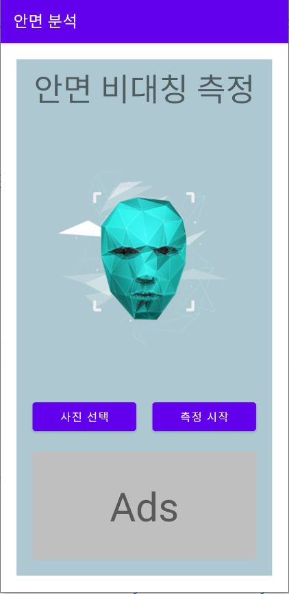
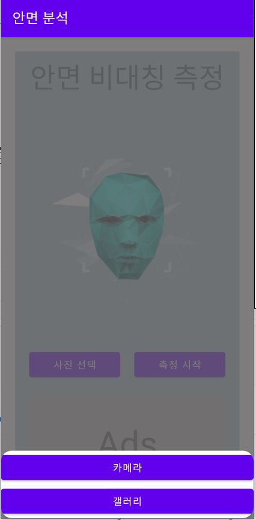
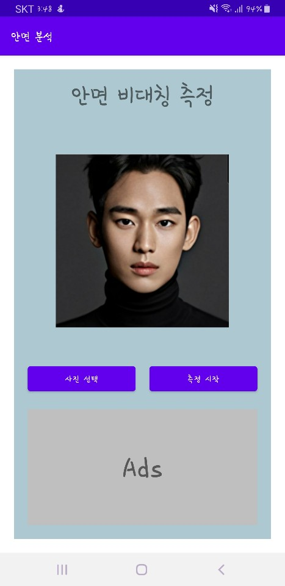
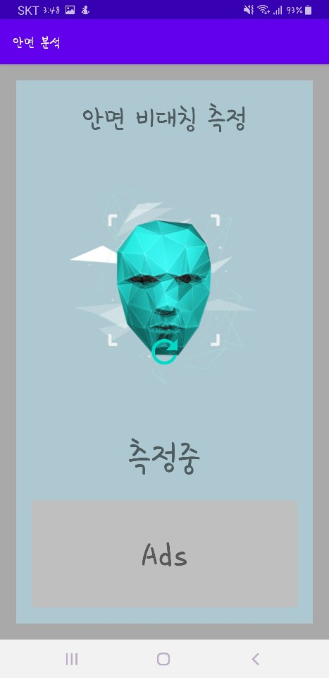

# Facial-analysis
---
</img>
 

2020 성남청소년재단 Pre-Internship 프로그램

 사용자가 자신의 안면 비대칭 정도를 판단할 수 있고안면 비대칭 관련 정보를 커뮤니티를 통해 공유할 수 있는 어플입니다.

## 개발환경
Android Studio SDK28

## How it  works
---
### Start Screen
</img>
 
Facial-analysis의 시작화면 입니다. 로그인과 회원가입을  선택하는 화면으로 어플이용에 있어서 커뮤니티나, 안면분석의 데이터의 보관을 용이하게 하기  위해 개개인의 코드를 부여하기 위함입니다.
어플의 핵심 이미지를삽입하여  구성하였습니다.

### Main Screen
---
#### Home Screen
</img>
 
화면이 3분할이 되어 맨위는 광고를 배치할수 있도록하고 중간을 터치하면 안면 비대칭 분석을 할수  있는 페이지로 전환이 됩니다.  마지막으로  맨 아래는 최근게시글을 스크롤로 볼수 있도록 하였습니다.

#### Post Screen
</img>
 
게시판으로 최근 게시글 부터 내림차순으로 정렬 되어있습니다. 화면이 스크롤 형식으로 맨위에서 아래로 내리면 페이지화면이 갱신되어 최근 게시물이 있다면 최근 게시글이 보이도록 화면을 수정합니다.
게시 글을 클릭하면 게시글의 내용이 보이며 제목옆 점3개가 찍혀있는 버튼을 누를경우 게시글 삭제 및 수정이 가능 합니다. 
그리고 초록 버튼을 누르면 새로운 게시글을 게시할수 있으며, 글, 사진, 동영상을을 첨부할수 있습니다.

#### User Info Screen
</img>
 
사용자의 정보를 저장하며 로그아웃과 회원정보 수정이 가능하도록 합니다.

### Facial-analysis Screen
</img>
</img>
</img>
</img>
 
사진 선택을 누르면 카메라또는 갤러리를 선택할수 있는 레이아웃이 생성이 됩니다.
카메라를 선택하면 카메라화면으로 변환이 되고, 얼굴화면을 찍으면 사진이 앱 내부저장소에 저장이 되고, 이 이미지 path를 변수에 저장합니다.
갤러리를 선택하면 이미지르 선택할수 있는화면으로 전환이 되고 이미지를 선택하면 이 이미지의 path를 변수에 저장을 합니다.
사진선택이 끝나면 어플의 핵심 이미지가 있는 위치에 선택한 사진으로 변환이 됩니다.
다른 사진을 선택하고자 한다면 다시 사진선택 버튼을 누르고 위 과정을 다시 진행합니다.
선택한 사진이 만족스럽다면 측정 시작버튼을 눌려 측정을 시작합니다.

### Facial-analysis Result Screen
</img>
 
측정이 완료가 되면 결과가 다음과 같이 생성하게 굅니다.
